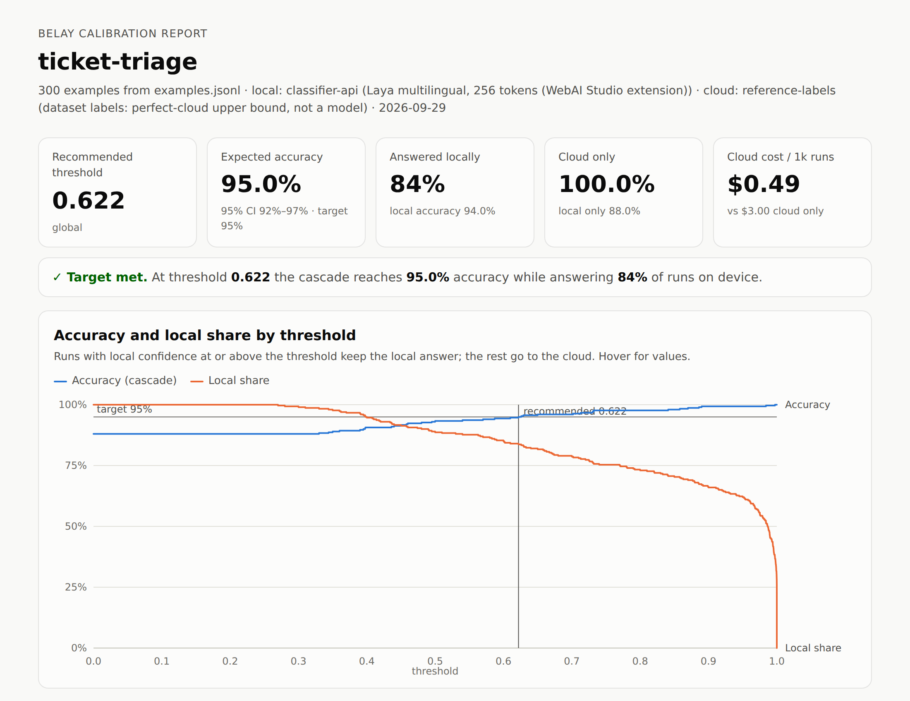

# Belay

Belay answers AI tasks with a small model on the user's device, and calls a cloud model only for
the inputs the small model is unsure about. You keep the cloud model's accuracy (sometimes you
beat it) for a fraction of its cost, and most inputs never leave the device.

**[Read the findings →](https://swissspidy.github.io/belay/)** what it saved and when it was more
accurate, on four real tasks against Claude, Gemini and Jev.

**Who it's for:** web apps that run the same AI task on text many times a day: routing support
tickets, moderating comments, detecting intents, extracting fields. Each cloud call costs money and
adds latency. Each on-device answer is free, private and fast, but on its own it isn't accurate
enough to trust.

**How it works:**

1. **Run locally first.** The task runs on an in-browser model: Chrome's built-in Classifier or
   Prompt API, or a polyfill such as the WebAI Studio extension, which runs the open Laya model.
   The model returns an answer and a confidence.
2. **Escalate when unsure.** If the confidence is below a threshold, the task sends the input to
   your cloud model through your backend, subject to your privacy rules (redaction, consent,
   never). Otherwise the local answer is used.
3. **Calibrate the threshold on your data.** `belay calibrate` runs your labeled examples through
   both models in a real browser. It picks the threshold that is at least as accurate as the cloud
   alone (or the most accurate one), measures what the cloud calls cost, and writes a calibration
   file and an HTML report with a cross-validated check and the mistakes to fix.
4. **Track savings in production.** Every run emits telemetry, and `savingsMeter()` adds up spend
   and savings from it.

It is built for classification (labels, yes/no, ratings), where the local model's own probability
is the confidence. It also runs [generation tasks](#generation-tasks-prompt-api) with structured
(JSON) output: an on-device LLM writes the answer, and a judge model scores it.

**What it isn't:** a model, a hosted service, or a general LLM router. Belay is a small library
(`@belay/core`, `@belay/web`) plus a calibration CLI (`@belay/calibrate`). You bring the local and
cloud models; Belay decides which one answers, and proves the decision on your data.

## Results

The [examples](examples) calibrate four tasks on public datasets (300 labeled examples each, 240 for
extraction). Accuracy is held out (five-fold cross-validation); costs are per million runs, priced
from measured token usage at list prices.

| Task | Cloud model | Cloud alone | With Belay | On device |
| --- | --- | --- | --- | --- |
| [Ticket triage](https://swissspidy.github.io/belay/reports/ticket-triage/belay-report.html) | Claude Opus 5.5 | 94.3%, $2,005 | **97.3%, $967** | 53% |
| [Content moderation](https://swissspidy.github.io/belay/reports/content-moderation/belay-report.html) | Jev 1.13 | 83.7%, $14.55 | **86.0%, $3.18** | 78% |
| [Intent detection](https://swissspidy.github.io/belay/reports/intent-detection/belay-report.html) | Jev → Claude | 99.7%, $71.42 | 99.3%, $64.00 | 37% |
| [Event extraction](https://swissspidy.github.io/belay/reports/event-extraction/belay-report.html) | Claude Opus 5.5 | 68.3%, $4,031 | 67.1%, $3,590 | 11% |

The [findings](https://swissspidy.github.io/belay/) compare every task against Claude Opus 5.5,
Gemini 3.8 Flash and Jev 1.13, and explain the results. In short: the cascade beat every cloud
model on ticket triage and moderation, because the local model was right where the cloud was wrong
on the runs it kept; it only saved money on intents, where the local model had no edge; and for
extraction, no judge could tell Gemini Nano's right answers from its wrong ones well enough.

[](https://swissspidy.github.io/belay/reports/ticket-triage/belay-report.html)

## Quick look

```ts
import { task, fetchAdapter } from '@belay/core';
import { classifierApi } from '@belay/web';

const triage = task({
  name: 'ticket-triage',
  schema: { type: 'categorical', options: ['bug', 'billing', 'feature', 'other'] as const },
  local: classifierApi(),
  cloud: fetchAdapter({ url: '/api/belay' }), // your backend calls the LLM
  threshold: 0.8, // or: calibration: '/belay.calibration.json'
});

const result = await triage.run(ticketText, { signal });
// {
//   value: 'billing',            // typed as 'bug' | 'billing' | 'feature' | 'other'
//   confidence: 0.93,
//   source: 'local',             // or 'cloud'
//   latencyMs: 31,
//   escalationReason: null,      // or 'low-confidence' | 'local-unavailable' | 'local-error' | 'local-timeout' | 'invalid-output'
//   escalationBlocked: null,     // or 'policy' | 'consent-denied' | 'cloud-error'
//   threshold: 0.8,
//   local: { value: 'billing', confidence: 0.93, latencyMs: 31, probabilities: [...] },
// }
```

**The rule:** the local answer is accepted if and only if `confidence >= threshold`. Otherwise the
task escalates, subject to your privacy policy.

## Packages

| Package              | What                                                                                   |
| -------------------- | -------------------------------------------------------------------------------------- |
| `@belay/core`        | Tasks, cascade, confidence combination, calibration file, cloud adapters. Zero runtime dependencies. |
| `@belay/web`         | Local runners for built-in AI: `classifierApi()`, `promptApi()`, and `classifierJudge()`. |
| `@belay/calibrate`   | `belay calibrate` CLI: runs your labeled data in a real Chrome, writes the calibration file and an HTML report. |

## Schemas

```ts
{ type: 'binary', prompt: 'Is this comment abusive?' }                  // value: boolean
{ type: 'categorical', options: ['bug', { label: 'billing', description: 'Invoices, refunds' }] }
{ type: 'ordinal', options: ['1', '2', '3', '4', '5'], prompt: 'How urgent is it?' }
{ type: 'structured', jsonSchema, validate }                            // generation tasks
```

Both runners' outputs are validated against the schema, so `result.value` is always one of your
options.

## Confidence

- **Classifier tasks**: the calibrated probability of the returned (top) label, as reported by the
  Classifier API. For binary tasks this is `max(P(true), P(false))`.
- **Generation tasks**: schema validation is a hard gate (an invalid output has confidence 0).
  After that, a judge (a Classifier API question such as "is this output correct?") supplies
  P(correct). When there are several signals, the lowest one wins.

The reasoning is in the [ADR](docs/adr/0001-public-api-confidence-and-calibration.md#decision-2-the-confidence-signal).

## Generation tasks (Prompt API)

```ts
import { promptApi, classifierJudge } from '@belay/web';

const summarize = task({
  name: 'ticket-summary',
  schema: { type: 'structured', jsonSchema, validate: isSummary }, // validate: Ajv, Zod, a type guard…
  local: promptApi(),         // LanguageModel with responseConstraint = jsonSchema
  judge: classifierJudge(),   // Classifier API: "is this answer correct and complete?" → P(true)
  cloud: fetchAdapter({ url: '/api/summarize' }),
  threshold: 0.8,
});
```

Each run prompts a fresh clone of a base session, so runs don't share history. An output that
fails `validate` escalates with `invalid-output` and the judge never sees it. Otherwise the judge's
calibrated P(true) is the confidence.

## Model downloads

`run()` never downloads a model. While the Classifier model is `downloadable` or `downloading`,
runs escalate with `escalationReason: 'local-unavailable'`. To download it, call `prepare()` from a
user gesture:

```ts
button.onclick = () => triage.prepare({ onProgress: (p) => (progress.value = p) });
```

Chrome exposes the Classifier API behind `chrome://flags/#classifier-api`. The
[WebAI Studio extension](https://web-ai.studio/playgrounds/classifier) polyfills it with a local
model. `classifierApi()` uses `globalThis.Classifier`, so it works with both. You can also pass
your own implementation: `classifierApi({ classifier })`.

## Cloud adapters

```ts
// Any async function: return the bare value, { value }, or a JSON string of either.
cloudAdapter(async ({ instruction, input, jsonSchema, local }, { signal, reportUsage }) => {
  const res = await callMyBackend(...);
  reportUsage({ model: res.model, inputTokens: res.usage.input_tokens, outputTokens: res.usage.output_tokens });
  return res.output;
});

// POST the request as JSON to your endpoint.
fetchAdapter({
  url: '/api/belay',
  headers: { 'x-csrf': token },
  select: (json) => json.output,
  usage: (json) => ({ model: json.model, inputTokens: json.usage.input_tokens, outputTokens: json.usage.output_tokens }),
});
```

The request includes a ready-made `instruction`, a `jsonSchema` for structured output, the
(redacted) `input`, and the local attempt. Keep provider API keys on your server. Reporting token
usage is optional; it lets calibration and `savingsMeter()` measure what the cloud costs.
[`examples/shared/cloud.mjs`](examples/shared/cloud.mjs) has runners for Claude (including
refusal fallbacks, priced per model), Gemini and Jev.

## Privacy

```ts
task({
  ...,
  privacy: {
    escalation: 'consent',             // 'auto' (default) | 'never' | 'consent'
    consent: ({ reason, input }) => confirm(`Send to the cloud for a better answer?\n\n${input}`),
    redact: (text) => text.replace(/\S+@\S+/g, '[email]'),
  },
});

await triage.run(text, { escalation: 'never' }); // per call: can only make the policy stricter
```

- `redact` runs before `consent` and before every cloud call. If it throws, nothing is sent.
- If escalation is blocked, you get the local answer with `escalationBlocked` set. If there is no
  local answer either, `run()` throws `BelayError('no-result')`.

## Calibration

Calibrate a task on labeled examples, in a real Chrome:

```sh
npm install --save-dev @belay/calibrate playwright-core
npx belay calibrate --task ticket-triage --data examples.jsonl --extension ./webai-extension
```

```js
// belay.config.mjs
import { defineConfig } from '@belay/calibrate';
import { cloudAdapter } from '@belay/core';
import { triageSchema } from './src/tasks.js'; // the same schema object your app uses

export default defineConfig({
  tasks: {
    'ticket-triage': {
      schema: triageSchema,
      local: { runner: 'classifier-api' },           // runs in Chrome, through @belay/web
      cloud: cloudAdapter(async (req) => callYourModel(req)), // runs in Node
      target: 'cloud',                               // default: never less accurate than cloud only
      cost: {                                        // optional: cost and savings
        currency: 'USD',
        prices: { 'claude-opus-5-5': { input: 4, output: 20, cacheRead: 0.2, cacheWrite: 5 } }, // per 1M tokens
        runsPerMonth: 1_000_000,                     // for the report's projection
      },
    },
  },
  browser: { extension: './webai-extension' },       // or args to enable the native API
});
```

- **Where it runs:** the local runner runs inside Chrome through the same `@belay/web` code your
  app ships, via Playwright with a persistent profile. The first run downloads the model with a
  real click, and later runs reuse it. The cloud runner runs in Node.
- **Output:** `belay.calibration.json` and a self-contained `belay-report.html`. The report has the
  accuracy / local-share / cost curves, the savings against sending everything to the cloud (with
  a monthly projection you can edit), a held-out accuracy estimate, the confidence distribution, a
  confusion matrix, per-option stats, and the confident local mistakes.
- **Cost:** with `prices`, every cloud call is priced from the token usage its runner reported,
  per model (so a refusal fallback is priced at the fallback model's rates). A model without a
  price fails the run instead of guessing. Without usage, `cloudPerRun` is a flat estimate, and
  the report says so.
- **Reproducibility:** every model output is cached in `.belay-cache/`, so a re-run replays it and
  writes the same file. Use `--refresh local|cloud|all` to re-query, and `--created-at` or
  `SOURCE_DATE_EPOCH` to pin the timestamp.
- **Threshold choice:** the recommended threshold is the lowest one whose cascade accuracy meets
  the target, which maximizes the local share. The target (`--target`) is one of:
  - `'cloud'` (default): the cloud-only accuracy, so the cascade saves money without losing any
    accuracy;
  - `'max'`: the most accurate threshold. When the local model is right where the cloud is wrong,
    this beats the cloud alone, at a smaller saving;
  - a number, e.g. `0.95`, which may be below the cloud's accuracy.

  `--per-label` also fits per-label thresholds. Because the threshold is fitted on the same examples
  it is scored on, the report and file also give a five-fold cross-validated (held-out) accuracy.

The task then loads the file instead of a hand-picked threshold:

```ts
task({ ..., calibration: '/belay.calibration.json', threshold: 0.8 /* fallback */ });
```

The file stores the recommended threshold (and optional per-label thresholds), the whole
accuracy / local-share / cost curve, and a confidence histogram for drift detection. It also stores
a fingerprint of the task schema, so a calibration made for different options or prompts is
rejected. See the [format](docs/adr/0001-public-api-confidence-and-calibration.md#decision-4-calibration-file-format-belaycalibrationjson-v1).


## Telemetry

```ts
task({ ..., onEvent: (e) => { if (e.type === 'run') metrics.record(e); } });
```

Each run emits one event with `source`, `label`, `confidence`, `localConfidence`, `threshold`,
`escalationReason`, `escalationBlocked`, the total, local and cloud latencies, and the cloud call's
token usage (`cloudUsage`) when its runner reports it. Events never contain the input text. Track
local share over time and compare it with the calibration's `expected.localShare` to detect drift.

`savingsMeter()` counts what the cascade saves in production:

```ts
import { savingsMeter } from '@belay/core';

const meter = savingsMeter({ prices, cloudPerRun: calibration.cost?.cloudPerRun, currency: 'USD' });
const triage = task({ ..., onEvent: meter.onEvent });

meter.summary();
// { runs: 1000, local: 470, cloud: 528, blocked: 2, cloudSpend: 1.06, costPerCloudRun: 0.002,
//   saved: 0.94, savedShare: 0.47, measuredCalls: 528, currency: 'USD' }
```

Only runs kept local because the local answer was confident count as saved, each valued at the
mean measured cost of a cloud call. Runs answered locally because escalation was blocked
(privacy policy, consent, cloud error) are counted separately as `blocked`.

## Status

Early. The API may change before 1.0. Design decisions are recorded in ADRs
[0001](docs/adr/0001-public-api-confidence-and-calibration.md) (API, confidence, calibration file),
[0002](docs/adr/0002-calibration-in-a-real-browser.md) (calibration in a real browser) and
[0003](docs/adr/0003-targets-relative-to-the-cloud-and-measured-cost.md) (targets, measured cost,
held-out accuracy).

Not in scope for now: routing between cloud models in the library (a cloud runner can do it, like
the examples' `cloudCascade()`), training or fine-tuning, server-side use.

## Development

```sh
npm install
npm run check   # typecheck, build, test
node site/build.mjs   # the findings site, into _site/
```

GitHub Actions workflows are audited with [zizmor](https://docs.zizmor.sh) on every push and pull
request (`uvx zizmor .github/` runs it locally). Actions are pinned to commit SHAs, and Dependabot
keeps them and the npm dependencies up to date.

## License

Apache-2.0
